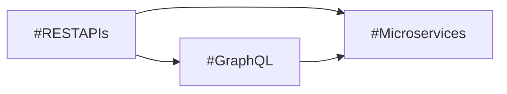
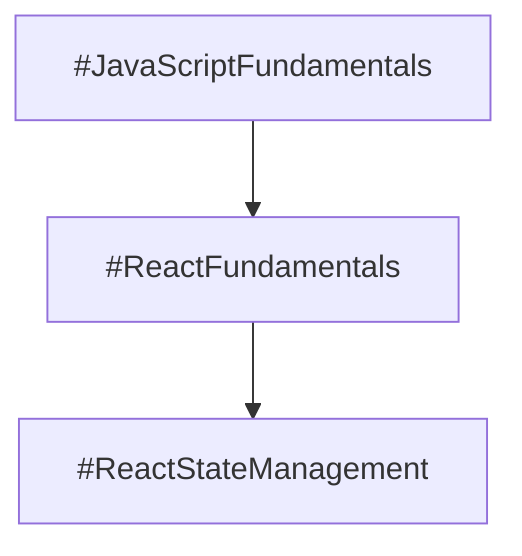

# Usage Examples

Complete examples demonstrating different ways to use the Obsidian Vault Generator.

## 📋 Table of Contents

1. [Quick Start Examples](#quick-start-examples)
2. [Makefile Examples](#makefile-examples)
3. [Script Examples](#script-examples)
4. [Manual AI Model Examples](#manual-ai-model-examples)
5. [Validation Examples](#validation-examples)

---

## Quick Start Examples

### Example 1: Generate First Vault (Easiest)

```bash
# Clone repository
git clone https://github.com/joaoMiraya/obsidian-planing.git
cd obsidian-planing

# Generate Kubernetes vault
make generate TOPIC="Kubernetes"
```

**What happens**:
1. ✅ Analyzes topic → detects "DevOps/Cloud" domain
2. ✅ Auto-generates context name → "Kubernetes"
3. ✅ Creates vault folder structure with `.obsidian/` config
4. ✅ Calls GitHub Copilot CLI to generate all content
5. ✅ Creates 15-30 permanent notes, study plan, indexes, diagrams

**Output**:
```
generated-vaults/
└── Kubernetes-vault/
    ├── .obsidian/           # 11 config files
    ├── 00-INDEX/
    ├── 10-CONTEXTS/Kubernetes/
    ├── 20-STUDY-PLANS/
    ├── 30-MAPS/
    └── 40-RESOURCES/
```

---

## Makefile Examples

### Example 2: Generate Prompt for ChatGPT

```bash
make prompt-only TOPIC="Machine Learning"
```

**Output**: Optimized prompt displayed in terminal. Copy and paste into ChatGPT.

**Prompt includes**:
- Topic analysis (domain: Data Science/ML)
- Related contexts suggestion (Python, Statistics, DataScience)
- Complete 5-phase generation strategy
- All 28 validation checks
- Common mistakes to avoid
- Example atomic concept format

### Example 3: Validate Generated Vault

```bash
# Generate vault
make generate TOPIC="Docker"

# Validate it
make validate VAULT_NAME=Docker-vault
```

**Validation output**:
```
🔍 Validating vault: ./generated-vaults/Docker-vault

Configuration Checks (5):
  ✓ .obsidian/ directory exists
  ✓ app.json has alwaysUpdateLinks enabled
  ✓ graph.json exists
  ✓ templates.json exists
  ✓ zettelkasten-styling.css exists

Structure Checks (4):
  ✓ 00-INDEX/ exists
  ✓ 10-CONTEXTS/ exists
  ✓ 20-STUDY-PLANS/ exists
  ✓ 30-MAPS/ exists
  ✓ 40-RESOURCES/ exists

Content Checks:
  ℹ Permanent notes found: 23
  ℹ Study plans found: 1

✅ Validation passed! No errors or warnings.
```

### Example 4: List All Generated Vaults

```bash
make list-vaults
```

**Output**:
```
Generated vaults in ./generated-vaults:
Kubernetes-vault
MachineLearning-vault
Docker-vault
GraphQL-vault
```

### Example 5: View Statistics

```bash
make stats
```

**Output**:
```
Vault Statistics:

Total vaults: 3

Kubernetes-vault:
  Permanent notes: 28
  Study plans: 1

MachineLearning-vault:
  Permanent notes: 35
  Study plans: 1

Docker-vault:
  Permanent notes: 23
  Study plans: 1
```

### Example 6: Pre-configured Examples

```bash
# Generate example vaults
make example-k8s       # Kubernetes
make example-ml        # Machine Learning
make example-graphql   # GraphQL APIs
```

---

## Script Examples

### Example 7: Custom Context Name

```bash
./scripts/generate-vault.sh \
  --topic "Machine Learning Fundamentals" \
  --context "MLFundamentals"
```

**Why**: Shorter, cleaner context name for folder structure.

### Example 8: Prompt-Only Mode

```bash
# Generate prompt for any AI model
./scripts/generate-vault.sh \
  --topic "GraphQL APIs" \
  --prompt-only
```

**Output**: Optimized prompt displayed in terminal, ready to paste into ChatGPT, Claude, or any AI model.

### Example 8b: Generate in a Different Language

```bash
# Generate vault with content in Portuguese
./scripts/generate-vault.sh \
  --topic "Kubernetes" \
  --lang pt

# Or via Makefile
make generate TOPIC="Kubernetes" LANGUAGE=pt
```

**What happens**: All generated content (descriptions, explanations, examples, study plans) will be written in Portuguese. File names, tags, and technical terms remain in English.

### Example 9: Custom Output Directory

```bash
./scripts/generate-vault.sh \
  --topic "Web Security" \
  --output ~/Documents/study-vaults
```

**Result**: Vault created at `~/Documents/study-vaults/WebSecurity-vault/`

### Example 10: Validate Existing Vault

```bash
./scripts/generate-vault.sh \
  --validate \
  --output ./my-existing-vault
```

**Use case**: Check if manually created vault follows all standards.

---

## Manual AI Model Examples

### Example 11: Complete ChatGPT Workflow

**Step 1**: Generate optimized prompt
```bash
./scripts/generate-vault.sh --topic "Kubernetes" --prompt-only
```

**Step 2**: Copy entire prompt output

**Step 3**: In ChatGPT:
1. Upload `.instructions` file
2. Upload `.zettelkasten` file
3. Paste optimized prompt
4. Wait for generation

**Step 4**: Save generated files to local vault

**Step 5**: Validate
```bash
make validate VAULT_NAME=Kubernetes-vault
```

### Example 12: Claude with Custom Requirements

**Generate enhanced prompt**:
```bash
./scripts/optimize-prompt.sh \
  "Docker Security" \
  "DockerSecurity" \
  "Focus on container isolation and vulnerability scanning"
```

**Upload to Claude**:
1. Upload instruction files
2. Paste generated prompt (includes custom requirements)
3. Review atomic concept table
4. Request specific note expansion if needed

### Example 13: Multi-Context Study Plan

Generate related contexts:

```bash
# Backend fundamentals
make generate TOPIC="REST APIs" CONTEXT="RESTAPIs"

# GraphQL as advancement
make generate TOPIC="GraphQL" CONTEXT="GraphQL"

# Microservices integration
make generate TOPIC="Microservices Architecture" CONTEXT="Microservices"
```

Then manually link them in `00-INDEX/Context-Map.md`:



---

## Validation Examples

### Example 14: Incremental Validation During Development

```bash
# Generate vault structure only
mkdir -p test-vault/{.obsidian,00-INDEX,10-CONTEXTS,20-STUDY-PLANS,30-MAPS,40-RESOURCES}

# Copy config
cp -r .obsidian test-vault/

# Validate structure
./scripts/generate-vault.sh --validate --output test-vault
```

**Output**: Shows which checks pass/fail as you build vault manually.

### Example 15: Batch Validation

```bash
# Validate all vaults
for vault in generated-vaults/*/; do
  echo "Validating: $vault"
  ./scripts/generate-vault.sh --validate --output "$vault"
  echo "---"
done
```

**Use case**: Quality check after bulk generation or updates.

---

## Advanced Examples

### Example 16: Prompt Optimization Analysis

```bash
# Compare prompts for different topics
./scripts/optimize-prompt.sh "Kubernetes" > prompts/k8s.txt
./scripts/optimize-prompt.sh "Machine Learning" > prompts/ml.txt
./scripts/optimize-prompt.sh "React" > prompts/react.txt

# Review differences
diff prompts/k8s.txt prompts/ml.txt
```

**Insight**: See how domain detection affects prompt structure.

### Example 17: CI/CD Validation Pipeline

```bash
#!/bin/bash
# validate-all.sh

set -e

for vault in generated-vaults/*/; do
  if ! ./scripts/generate-vault.sh --validate --output "$vault"; then
    echo "❌ Validation failed for: $vault"
    exit 1
  fi
done

echo "✅ All vaults validated successfully"
```

**Use case**: Automated quality checks in CI/CD pipeline.

### Example 18: Template Testing

```bash
# Generate test vault
make generate TOPIC="Test Subject"

# Inspect generated permanent note structure
head -50 generated-vaults/TestSubject-vault/10-CONTEXTS/TestSubject/permanent-notes/*.md

# Verify frontmatter
grep -A 10 "^---$" generated-vaults/TestSubject-vault/10-CONTEXTS/TestSubject/permanent-notes/*.md | head -30
```

**Use case**: Verify note templates are correctly applied.

---

## Troubleshooting Examples

### Example 19: Permission Issues

```bash
# Make scripts executable
chmod +x scripts/*.sh

# Verify
ls -l scripts/
```

### Example 20: Clean Start

```bash
# Remove all generated vaults
make clean

# Confirm deletion
make list-vaults  # Should show "No vaults found"

# Generate fresh vault
make generate TOPIC="Kubernetes"
```

---

## Real-World Workflow

### Example 21: Complete Study Journey

**Day 1**: Foundation
```bash
make generate TOPIC="JavaScript Fundamentals"
```

**Day 7**: Advancement
```bash
make generate TOPIC="React Fundamentals"
```

**Day 14**: Specialization
```bash
make generate TOPIC="React State Management"
```

**Review progress**:
```bash
make stats
```

**Link contexts** in `00-INDEX/Context-Map.md`:


---

## Tips & Best Practices

### Topic Naming

✅ **Good**:
- "Kubernetes"
- "Machine Learning Fundamentals"
- "GraphQL API Design"

❌ **Avoid**:
- "Learn Kubernetes" (not declarative)
- "K8s stuff" (too vague)
- "Everything about ML" (too broad)

### Context Names

✅ **Good**:
- Auto-generated (e.g., "Kubernetes")
- PascalCase (e.g., "MachineLearning")
- Concise (e.g., "GraphQL")

❌ **Avoid**:
- Spaces (e.g., "Machine Learning")
- Special characters (e.g., "ML&AI")
- Too long (e.g., "MachineLearningAndArtificialIntelligenceFundamentals")

### Validation Frequency

- ✅ **After generation**: Always validate
- ✅ **Before committing**: Batch validate all vaults
- ✅ **After manual edits**: Re-validate to ensure compliance

---

## Next Steps

After generating your vault:

1. **Open in Obsidian**: File → Open folder as vault
2. **Install plugins**: Settings → Community plugins → Browse
3. **Review study plan**: `20-STUDY-PLANS/[Context]-Study-Plan.md`
4. **Start learning**: Follow Phase 1 concepts
5. **Use graph view**: Visualize connections (Cmd/Ctrl+Shift+G)
6. **Track progress**: Check off concepts as you learn

